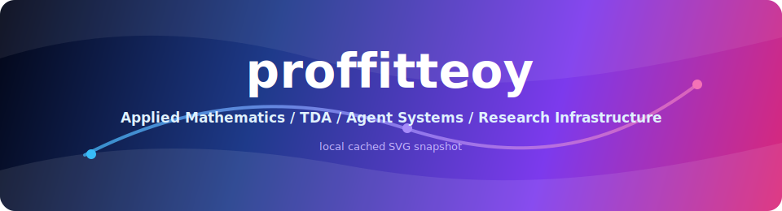
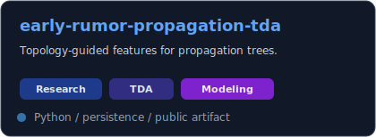
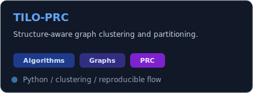
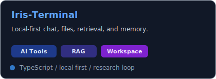
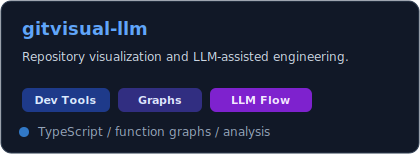
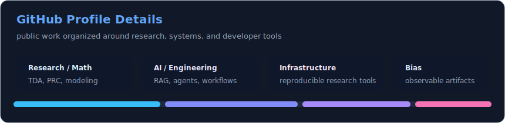
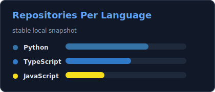
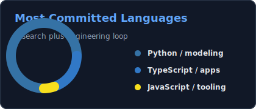
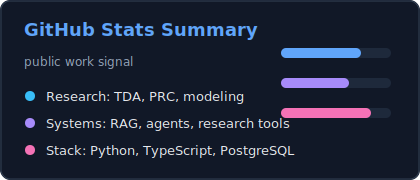
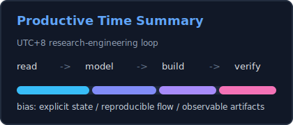

<div align="center">

<!-- Images use local SVG snapshots from assets/generated to avoid third-party image outages and stale proxy caches. -->


<br />


<br />


<a href="https://nothing-new.icu/">
  
</a>

</div>

---

## Tech Radar

<div align="center">


<br />
<br />


</div>

---

## Project Constellation

<table>
<tr>
<td width="50%">

### Research / Math

<a href="https://github.com/proffitteoy/early-rumor-propagation-tda">
  
</a>

<a href="https://github.com/proffitteoy/TILO-PRC">
  
</a>

</td>
<td width="50%">

### AI / Engineering

<a href="https://github.com/proffitteoy/Iris-Terminal">
  
</a>

<a href="https://github.com/proffitteoy/gitvisual-llm">
  
</a>

</td>
</tr>
</table>

---

## Mission Control

| Track | Signal | Public artifact |
| --- | --- | --- |
| Topological Data Analysis | Persistent homology, propagation trees, topology-guided features | [`early-rumor-propagation-tda`](https://github.com/proffitteoy/early-rumor-propagation-tda) |
| Topology-guided Algorithms | Graph clustering, PRC, TILO, structure-aware partitioning | [`TILO-PRC`](https://github.com/proffitteoy/TILO-PRC) |
| AI Research Workspace | Local-first chat, files, retrieval, memory, Obsidian integration | [`Iris-Terminal`](https://github.com/proffitteoy/Iris-Terminal) |
| Agent Orchestration | Context packaging, review loops, generated artifacts | [`ManiMind`](https://github.com/proffitteoy/ManiMind) |
| Developer Tools | Repository visualization, function graphs, LLM-assisted engineering | [`gitvisual-llm`](https://github.com/proffitteoy/gitvisual-llm) |
| Security Platform | WAF logs, incident analysis, policy loop, action audit | [`waf-incident-platform`](https://github.com/proffitteoy/waf-incident-platform) |

---

## GitHub Telemetry

<div align="center">



<br />




<br />




</div>

---

## Long-term Direction

```text
Applied Mathematics
  -> Topological Data Analysis
  -> Data Modeling
  -> AI Agent Systems
  -> Research Tools
  -> Open Source Infrastructure
```

<div align="center">


</div>
