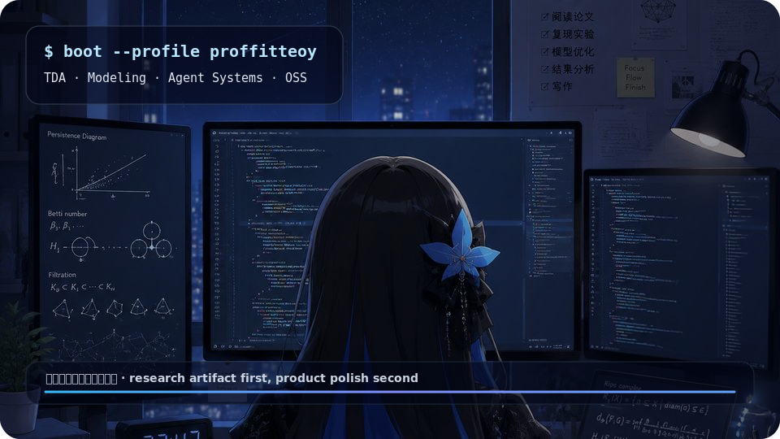
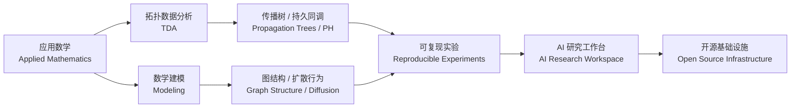

<!--
  Profile README / 个人主页
  Design target: bilingual developer dashboard, not a generic portfolio template.
  Main visual: ./assets/generated/profile-studio.svg
-->

<div align="center">



</div>

<table>
<tr>
<td width="58%">

# proffitteoy

```bash
$ whoami
applied-math-student --tda --ai-systems --open-source

$ current_loop
read -> model -> build -> verify -> publish
```

**中文**：我关注应用数学、拓扑数据分析、AI-native 研究系统与可复现开源工具。我的目标不是堆项目，而是把理论、实验、代码、数据和文档组织成可以被检查、复现、复用的系统。

**EN**: I work across applied mathematics, topological data analysis, AI-native research systems, and reproducible open-source tooling. I care about artifacts that can be inspected, reproduced, and extended.

</td>
<td width="42%">

### System Tags / 系统标签

```yaml
role: Applied Mathematics Student
focus:
  - Topological Data Analysis
  - Mathematical Modeling
  - AI Research Workspace
  - Open Source Engineering
bias:
  - explicit_state
  - reproducible_flow
  - observable_artifacts
```

<a href="https://nothing-new.icu/">
  
</a>


</td>
</tr>
</table>

---

## 01 · Profile / 个人介绍

| 中文 | English |
| --- | --- |
| 应用数学方向学生，偏研究与工程交叉。 | Applied mathematics student working across research and engineering. |
| 研究侧关注传播结构、拓扑表示、统计验证与可复现实验。 | Research side: propagation structures, topological representations, statistical validation, reproducible experiments. |
| 工程侧关注本地优先 AI 工作台、Agent 编排、代码库理解与开源补丁流。 | Engineering side: local-first AI workspace, agent orchestration, codebase understanding, open-source patch workflow. |
| 长期方向是把数学建模能力沉淀为研究工具和开源基础设施。 | Long-term direction: turning mathematical modeling ability into research tools and open-source infrastructure. |

```text
research input      -> papers / datasets / codebases
modeling layer      -> TDA / graph structure / diffusion behavior
engineering layer   -> local tools / agents / reproducible pipelines
public output       -> paper artifacts / repositories / patches / notes
```

---

## 02 · Languages & Tech Stack / 语言与技术栈

<table>
<tr>
<td width="50%">

### Research Core / 研究内核

| Stack | Use |
| --- | --- |
| Python | TDA experiments, feature construction, pipelines |
| R | statistics, validation, reporting |
| LaTeX | papers, formulas, reproducible manuscript artifacts |
| Persistent Homology | topology-guided representation of structures |

</td>
<td width="50%">

### Engineering Surface / 工程外壳

| Stack | Use |
| --- | --- |
| TypeScript / JavaScript | AI workspace, dashboards, tools |
| React / Next.js / Tailwind | frontend systems and interface prototypes |
| FastAPI / Prisma | APIs and structured service layer |
| PostgreSQL / SQLite | state, memory, metadata, retrieval base |

</td>
</tr>
</table>

<div align="center">


</div>

---

## 03 · Focus Pipeline / 关注方向



| Direction / 方向 | Current Target / 当前目标 |
| --- | --- |
| Topological Data Analysis / 拓扑数据分析 | Persistent homology for propagation-tree point clouds / 面向传播树点云的持久同调分析 |
| Mathematical Modeling / 数学建模 | Graph structure, diffusion dynamics, statistical testing / 图结构、扩散行为与统计检验 |
| AI Research Workspace / AI 研究工作台 | Local-first chat, files, retrieval, memory, Obsidian integration / 本地优先聊天、文件、检索、记忆与 Obsidian 集成 |
| Agent Systems / Agent 系统 | Context packaging, review loops, generated artifacts / 上下文打包、审查循环、生成式产物 |
| Developer Tools / 开发者工具 | Repository visualization, function graphs, LLM-assisted engineering / 仓库可视化、函数图、LLM 辅助工程 |

---

## 04 · Original Works / 原创作品精选

<table>
<tr>
<td width="50%">

### Research Kernel / 研究内核

| Project | Signal |
| --- | --- |
| [`early-rumor-propagation-tda`](https://github.com/proffitteoy/early-rumor-propagation-tda) | Persistent homology for early rumor propagation trees / 早期谣言传播树的持久同调分析 |
| [`TILO-PRC`](https://github.com/proffitteoy/TILO-PRC) | Structure-aware graph clustering and partitioning / 结构感知图聚类与划分 |

</td>
<td width="50%">

### AI Systems / AI 系统

| Project | Signal |
| --- | --- |
| [`Iris-Terminal`](https://github.com/proffitteoy/Iris-Terminal) | Local-first AI research workspace / 本地优先 AI 研究工作台 |
| [`ManiMind`](https://github.com/proffitteoy/ManiMind) | Agent orchestration and artifact generation / Agent 编排与产物生成 |

</td>
</tr>
<tr>
<td width="50%">

### Developer Tools / 开发者工具

| Project | Signal |
| --- | --- |
| [`gitvisual-llm`](https://github.com/proffitteoy/gitvisual-llm) | Repository visualization and LLM-assisted engineering / 仓库可视化与 LLM 辅助工程 |

</td>
<td width="50%">

### Security & Operations / 安全与运维

| Project | Signal |
| --- | --- |
| [`waf-incident-platform`](https://github.com/proffitteoy/waf-incident-platform) | WAF logs, incident analysis, policy loop / WAF 日志、事件分析与策略闭环 |

</td>
</tr>
</table>

---

## 05 · Open Source Contributions / 开源贡献

```diff
+ reproduce issue
+ locate minimal failing path
+ patch with small surface area
+ verify locally
+ respond to review
+ track release branch behavior
```

| Upstream / 上游项目 | Contribution Style / 贡献方式 |
| --- | --- |
| [`open-ani/animeko`](https://github.com/open-ani/animeko) | Android / Kotlin Multiplatform debugging, bug fixing, build verification, PR workflow / Android 与 KMP 调试、缺陷修复、构建验证、PR 协作 |
| [PR search: open-ani/animeko by proffitteoy](https://github.com/open-ani/animeko/pulls?q=is%3Apr+author%3Aproffitteoy) | Public patch log / 公开补丁记录 |
| Windows adaptation work / Windows 适配实践 | Environment setup, path handling, local verification, cross-platform debugging / 环境配置、路径处理、本地验证、跨平台调试 |
| General GitHub workflow / 通用 GitHub 工作流 | Issue reproduction, minimal patch design, regression testing, review response / 问题复现、最小补丁设计、回归测试、review 响应 |

---

## 06 · Operating Map / 工作系统

```yaml
research:
  input: papers + datasets + codebases
  transform: modeling + experiments + validation
  output: reproducible artifacts

engineering:
  input: issues + traces + requirements
  transform: minimal_patch + local_verification + review_loop
  output: maintainable_open_source_contribution

long_term:
  - Applied Mathematics
  - Topological Data Analysis
  - Data Modeling
  - AI Agent Systems
  - Research Tools
  - Open Source Infrastructure
```

<div align="center">


</div>
